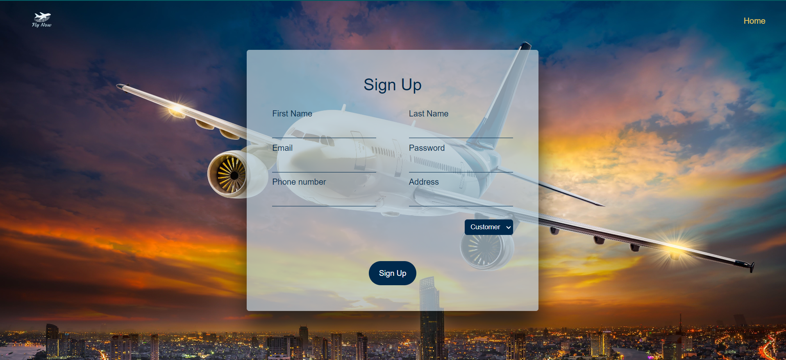
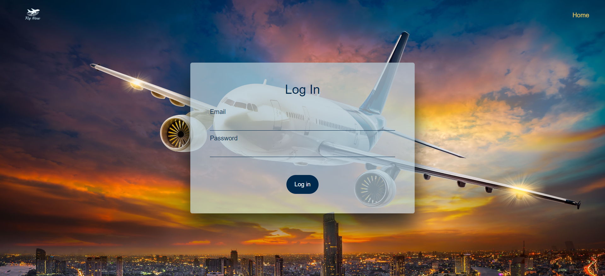
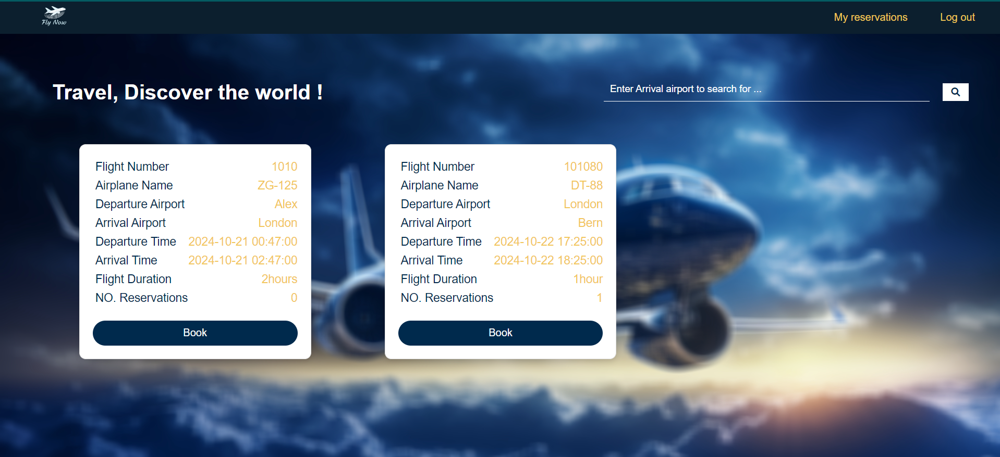
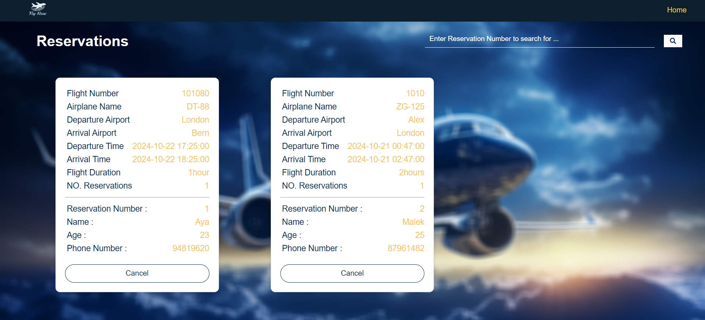
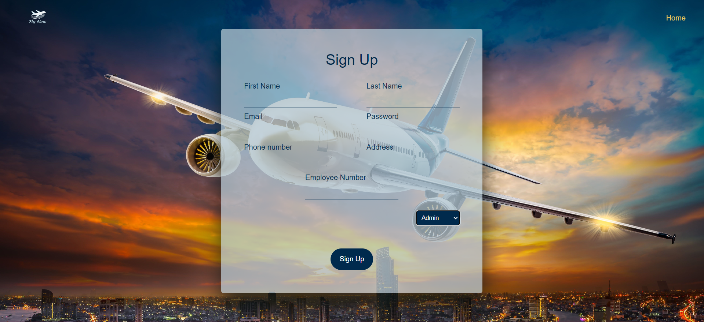
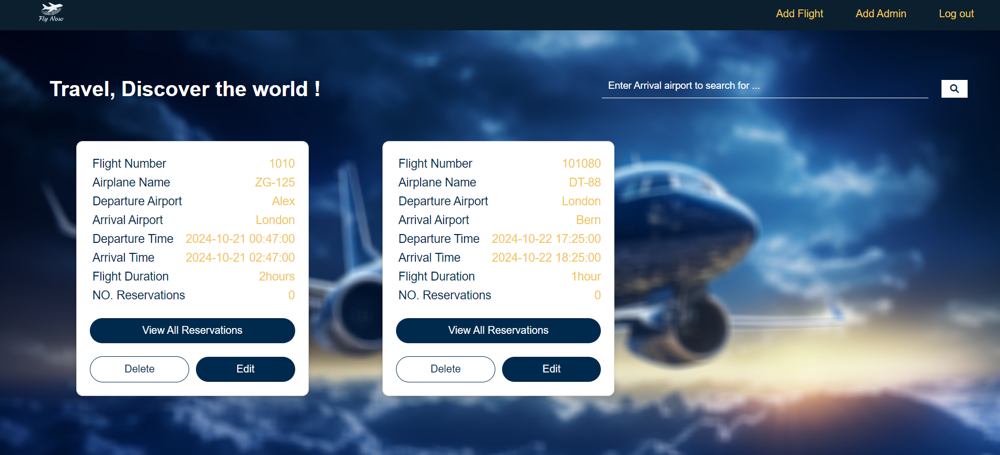
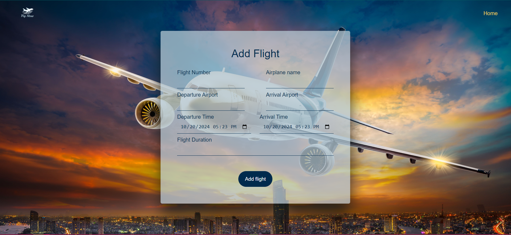
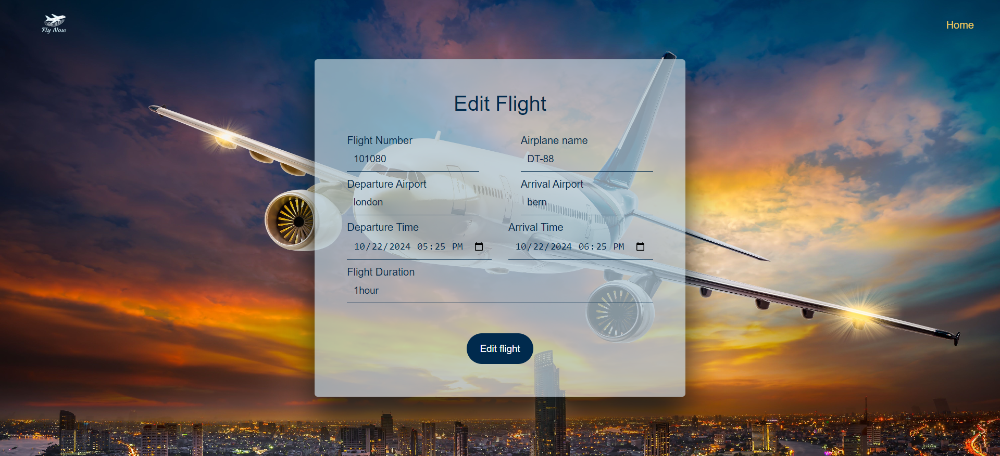
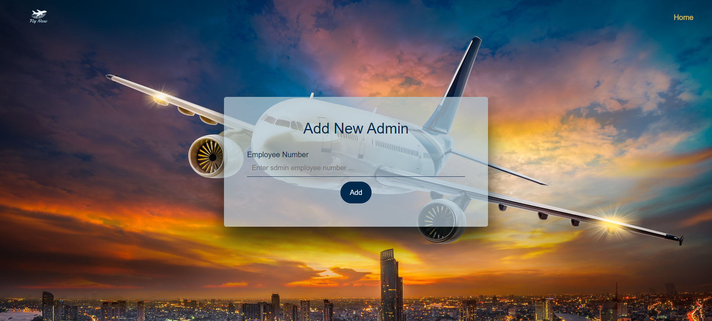
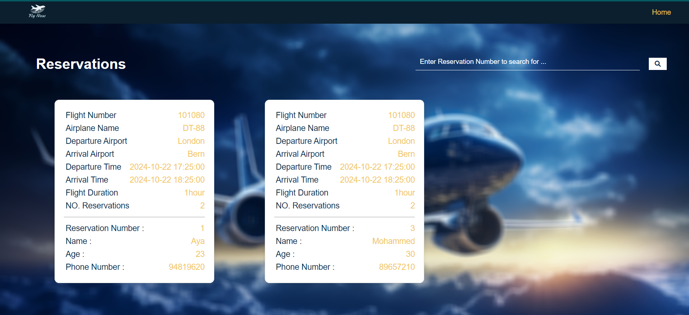

# Flight Booking System

A web-based application for booking flights, built with HTML, CSS, JavaScript (frontend), and Flask (backend). The system provides different features for visitors, customers, and admins, leveraging SQLAlchemy and SQLite for database management.

## Table of Contents

- [Features](#features)
- [Installation](#installation)
- [Usage](#usage)
- [Screenshots](#screenshots)
- [Technologies Used](#technologies-used)
- [Contributing](#contributing)
- [License](#license)

## Features

### Visitor:
- **Sign Up**: Create a new account.
- **Login**: Access the customer dashboard.
- **View Flights**: Browse available flights and search by arrival airport.

### Customer:
- **Book Flights**: Secure a reservation for a flight.
- **View Reservations**: See all booked flights.
- **Cancel Reservations**: Remove a booking if necessary.
- **Search Reservations**: Find specific reservations by reservation number.

### Admin:
- **Manage Flights**: 
  - Add new flights.
  - Edit existing flight details.
  - Delete flights.
  - Add new Admins.

## Installation

### Prerequisites:
- [Python 3.x](https://www.python.org/)
- [Flask](https://flask.palletsprojects.com/en/2.0.x/)
- [SQLAlchemy](https://www.sqlalchemy.org/)

### Setup:

1. Clone this repository:
    ```bash
    git clone https://github.com/AyaHusein2001/epfl-final-project
    cd epfl-final-project
    ```

2. Install required Python packages:
    ```bash
    pip install flask sqlalchemy
    ```

3. Run the Flask application:
    ```bash
    flask run
    ```

4. Access the app by navigating to `http://127.0.0.1:5000` in your browser.

## Usage

1. **Visitors** can sign up or log in to search available flights.
2. **Customers** can book flights, view their reservations, cancel reservations, and search by reservation number.
3. **Admins** can manage the flight schedule by adding, editing, or deleting flights, adding new Admins.

## Screenshots
- **Sign Up**

- **Login**

- **Customer Home Page**

- **Customer Reservations Page**

- **Sign Up as Admin**

- **Admin Home Page**

- **Admin add flight**

- **Admin edit flight**

- **Admin Add new Admin**

- **Admin View Flight Reservations**


## Technologies Used

- **Frontend**: HTML, CSS, JavaScript
- **Backend**: Flask (Python)
- **Database**: SQLite with SQLAlchemy ORM

## Contributing

Feel free to fork the repository, create a new branch, and submit a pull request for any improvements.